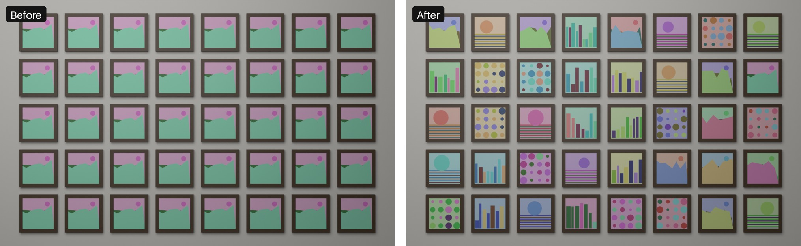

# Image Per Instance Lite: a different texture on every object in Blender (free)

**One shared material, a different image on every object.** Pick a folder of images, press two buttons, done.
No hand-built node setup, no 20 duplicated materials.

> **Get the full version:** Image Per Instance on [Superhive](https://superhivemarket.com/products/image-per-instance) or [Gumroad](https://quadfix.gumroad.com/l/image-per-instance) ($8) removes the 20 image limit and adds **Geometry Nodes instances** (Instance on Points, Array modifier) and **Shuffle**. Lite stays free and complete for what it lists here.

*Same scene, same single material. Left: one image everywhere. Right: each frame has its own picture.*

## What it does

1. **Build Atlas**: packs all images from a folder into one texture atlas stored inside your .blend.
2. **Apply To Selected Objects**: every selected mesh gets its own image through one shared material.

Typical uses: posters and paintings on a wall, book covers, cards, tiles, game props, packaging, screens.

## Quick start

1. Install the zip: **Edit > Preferences > Get Extensions > arrow (top right) > Install from Disk**.
2. In the 3D viewport press **N** and open the **Image Per Instance Lite** tab.
3. Choose the **Image Folder**, a **Tile Size**, press **Build Atlas**.
4. Select your objects and press **Apply To Selected Objects**.

## Free version limits

- Up to **20 images** per atlas
- Separate objects only (no Geometry Nodes instances, Instance on Points or Array support)
- Order by file name

Objects need UVs that fill the 0-1 square (a plane or an unwrapped cover). Images are resized to square tiles of one size. The image goes on material slot 1; other slots are not touched. Atlas size is limited to 16384 px per side.

## Tested

Automated tests pass on Blender **4.2.23**, **4.5.14** and **5.2.2**: the test renders every tile and checks its colour, checks the 20 image limit and the empty-folder error. No internet, no external files, no binaries; works on macOS, Windows and Linux.

## License

GPL-3.0-or-later. See [LICENSE](LICENSE). Support: support@dynamicflower.pt
